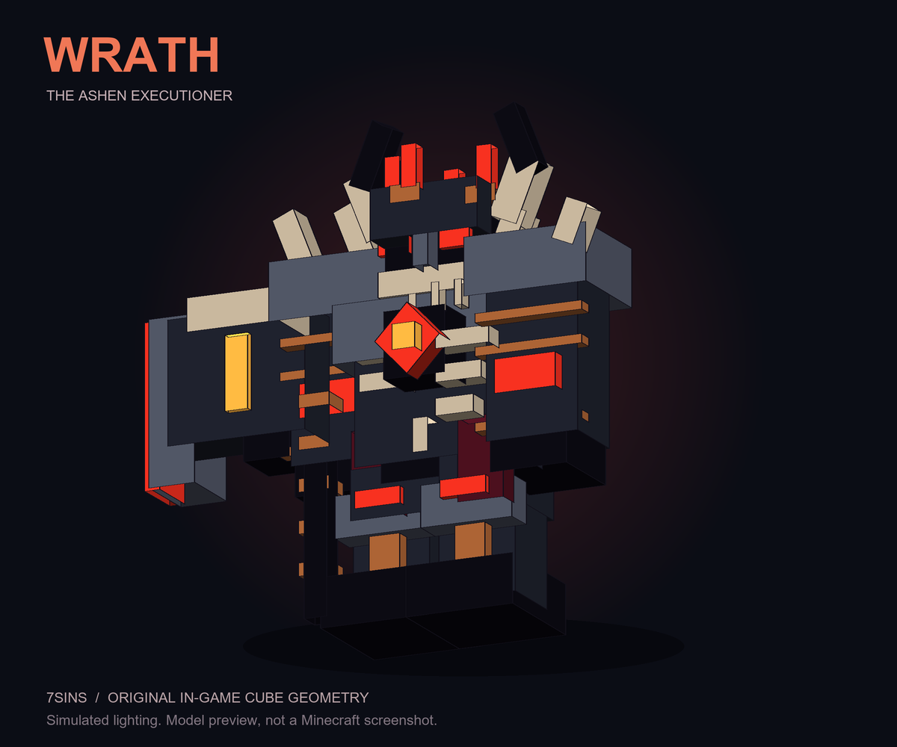

# 7sins

บอสตัวแรก **Wrath — The Ashen Executioner** อัศวินปีศาจเกราะดำ เขากระดูก ดวงตาแดง
ซี่โครงล้อมหัวใจไฟ ค้อนประหาร และมงกุฎแตกที่หมุนอยู่เหนือศีรษะ ใช้ Husk ล่องหนเป็นฐาน
โมเดลต้นฉบับประกอบด้วย 86 กล่อง แยกเป็น 9 ชิ้นเคลื่อนไหว ไม่ต้องติดตั้ง ModelEngine หรือม็อดฝั่ง Java



ภาพนี้เรนเดอร์จากรูปทรงโมเดลเดียวกับแพ็ก ใช้แสงจำลอง ไม่ใช่ภาพถ่ายจาก Minecraft

## ติดตั้งและเรียกบอส

1. ใช้ Paper **26.2** และ Java **25** วาง `dist/7sins.jar` ใน `plugins/` แล้วเริ่มเซิร์ฟเวอร์ใหม่
2. แพ็ก Java ถูกฝังใน JAR; เซิร์ฟเวอร์จะส่งแพ็กจาก [GitHub raw URL ที่ตรึงไว้กับ commit SHA](https://raw.githubusercontent.com/40000years/Evergarden2/d594e164da75d30484e07de63f325f20d270c39c/7sins/src/main/resources/resource-packs/7sins-java.zip)
   และ Minecraft ตรวจสอบ SHA-1 ของ ZIP จากไฟล์ที่ฝังในปลั๊กอินก่อนโหลด
3. หากใช้ URL ส่วนตัวให้แทนที่ `resource-pack.url`; ปล่อยค่าว่างเพื่อใช้เซิร์ฟเวอร์ไฟล์ในตัว
   กรณีนี้เปิด TCP **8188** และตั้ง `resource-pack.host.public-host` เป็น IP หรือชื่อโฮสต์ของเซิร์ฟเวอร์
4. เข้าเกมและยอมรับแพ็ก ใช้ `/7sins pack` ส่งแพ็กซ้ำได้
5. ผู้ดูแลใช้ `/7sins spawn wrath` ในพื้นที่เปิด มีพื้นรองรับตัวฐานประมาณ 7×7 และความสูงว่าง 20 บล็อก (ขนาดเริ่มต้น 5 เท่า)
   ระบบเริ่มค้นหาห่างไป 35 บล็อก แล้วลองจุดด้านข้างและใกล้ลงถึง 20 บล็อกหากจุดแรกใช้ไม่ได้
   บอสเตรียมตัว 4 วินาที ผู้เล่นต้องอยู่ใน Survival หรือ Adventure เพื่อเข้าต่อสู้

แพ็กใช้ UUID และ namespace ของตัวเอง ส่งเพิ่มในรายการแพ็กโดยไม่แทนที่แพ็ก Advance Magic
ไฟล์ต้นฉบับของ ZIP อยู่ใน `src/main/resources/resource-packs/`; ใน `dist/` เผยแพร่เฉพาะ JAR

อัปเดตจาก 0.2.0 โดยแทนที่ JAR แล้วเริ่มเซิร์ฟเวอร์ใหม่ ไม่ต้องลบ config:
เลือดเดิม 600 จะเปลี่ยนเป็น 1800 และ URL แพ็ก GitHub ทางการจะเปลี่ยนเป็นรุ่นที่ตรงกับ JAR
ค่าเลือดที่ปรับเองและ URL โฮสต์ส่วนตัวจะคงไว้ ผู้เล่นใช้ `/7sins pack` เพื่อรับแพ็กใหม่
รุ่น 0.3.0 ใช้มุมหมุนต่อเนื่องร่วมกันทุกชิ้น แยกการหมุนออกจากการย้ายตำแหน่ง และขยายขอบเขตแสดงผลของหัว/มงกุฎ

รุ่น **0.4.0** ผูกค้อนกับจุดจับในมือและใช้ลำดับยก–เหวี่ยง–กระแทก–ถอนอาวุธ ดาเมจออกตอนจบท่าเหวี่ยง
ท่าเดินอิงระยะทางจริง มีการยกเท้า โยกลำตัว และค่อย ๆ หยุดก้าว แทนการแกว่งแขนขาคงที่
ตัวฐานถูกล้างอุปกรณ์ที่อาจมองเห็นทะลุโมเดล และซ่อนร่างสำรองก่อนแสดงโมเดลเต็ม
ดู [แอนิเมชันจากท่าในโค้ดและรูปทรงแพ็ก](art/wrath-animation.gif) หรือ [ลำดับท่าค้อน](art/wrath-slam-poses.png)
ภาพเหล่านี้เป็นการเรนเดอร์จำลอง ไม่ใช่การบันทึกภาพจากไคลเอนต์ Minecraft

รุ่น **0.5.0** ขยายโมเดลและตัวฐานเป็น **5 เท่า** เพิ่มดาเมจทุกท่าเป็น **3 เท่า** และขยายพื้นที่เตือนตามขนาด
ค่ามาตรฐานเก่าใน config จะอัปเกรดเอง: ตัวคูณดาเมจ 1 → 3 และรัศมีสนาม 28 → 140 บล็อก
ค่าที่ปรับเองจะคงไว้ ปรับขนาดได้ที่ `wrath.model-scale` และช่วงดูดซับได้ที่ `wrath.phase-two-absorption-seconds`

รุ่น **0.5.1** แก้ตัวตรวจจุดเกิดที่ปฏิเสธพื้นครึ่งบล็อก ใช้ผิวชนจริงของ slab/พรมและความสูงแบบทศนิยม
ตรวจพื้นที่ตามขนาดตัวฐานแทนการบังคับพื้นเต็ม 11×11 ที่ระดับเดียวกัน รองรับการเรียกขณะลอยเหนือพื้นไม่เกินระยะค้นหา 64 บล็อก
ถ้าจุดด้านหน้าใช้ไม่ได้จะลองตำแหน่งใกล้เคียง และแจ้งแยกกรณีไม่พบพื้น พื้นต่างระดับมาก หรือพื้นที่ติดสิ่งกีดขวาง

รุ่น **0.5.2** ล้างอุปกรณ์ของ Husk หลังส่งเหตุการณ์เกิดและระหว่างต่อสู้ด้วย
จึงไม่ทิ้งเกราะหรืออาวุธที่ปลั๊กอินอื่นใส่เพิ่มไว้ภายในโมเดล ล้างการเรืองแสงของตัวฐานและคง hitbox สำหรับโจมตีไว้
เมื่อผู้เล่นออนไลน์ทุกคนโหลดแพ็กแล้ว จะลบร่างเกราะสำรองออกจากโลก และสร้างกลับเฉพาะเมื่อมีผู้เล่นที่ต้องใช้ร่างสำรอง
แพ็กและ SHA-1 ใช้ไฟล์เดิม ไม่ต้องล้างแคชแพ็กหรือเปลี่ยน config

รุ่น **0.6.0** เพิ่มแรงกดดันต่อการวิ่งถอยยิงธนู:

- ระเบิดตอนเกิด **200 ดาเมจก่อนเกราะ/โล่** ในรัศมี **40 บล็อก** หนึ่งครั้ง เมื่อเซิร์ฟเวอร์เริ่มอัปเดตบอส
  ดาเมจนี้ไม่คูณซ้ำด้วยตัวคูณดาเมจ 3 เท่า ไม่ทะลุกำแพง ไม่ทำลายบล็อก และไม่โจมตี Creative/Spectator
- ความเร็วพื้นฐานจาก 0.25 → **0.42** ช่วงคลั่งเพิ่มอีก 15% และลดระยะพัก/เตรียมท่าหนัก
- ดาบเรียกเมื่อผู้เล่นห่าง **20 บล็อก** โดยไม่ผูกเกณฑ์กับขนาดบอส แก้เกณฑ์เดิมที่ขยายเป็น 40 บล็อก
  ใช้นาฬิกาแยกจากท่าประชิด คนยิงธนูถูกให้ความสำคัญ 6 วินาที และการยิงโดนเร่งการตอบโต้
- ดาบดักตำแหน่งที่ล็อกไว้พร้อมทางถอยออกไปอีก 3/6 บล็อก มีวงแดงก่อนขึ้นทุกจุดและหลบด้านข้างได้
  ทุกการตอบโต้ระยะไกลครั้งที่สามเป็นพุ่งชน ท่าต่อไปไม่ตัดคลื่นดาบเดิมที่ยังเตือนอยู่
- ค้อนเพิ่ม **72 → 108 ดาเมจ** และดาบ **72 → 96 ดาเมจ** ก่อนเกราะ/โล่/โบนัสคลั่ง
  ค้อนที่โดนจริงทำให้เดินและกระโดดไม่ได้ 1 วินาที แล้วช้าลง 80% อีก 2 วินาที พร้อมเสียงและแอนิเมชันสะเทือนเมื่อได้รับบาดเจ็บ
  การโจมตีที่ถูกยกเลิกหรือโล่ป้องกันหมดไม่ทำให้ติดอาการ ค่าการเคลื่อนที่กลับเมื่อหมดเวลา เปลี่ยนโลก ตาย ออกเกม หรือบอสถูกลบ

ปรับได้ที่ `wrath.movement-speed`, `wrath.ranged-trigger-distance`, `wrath.arrival.damage` และ `wrath.arrival.radius`
ค่าใหม่เติมเข้า config เดิมอัตโนมัติ แพ็กโมเดลยังเป็นไฟล์เดิม

| คำสั่ง | ผล |
|---|---|
| `/7sins spawn wrath` | เรียกบอส ต้องมี `7sins.admin` (ค่าเริ่มต้น: OP) |
| `/7sins remove` | ลบบอสใกล้ที่สุดในระยะ 64 บล็อก ไม่ดรอปรางวัล |
| `/7sins list` | ดูพิกัด เลือด และสถานะของบอสที่กำลังทำงาน |
| `/7sins pack` | ขอแพ็กใหม่และดูสถานะการส่ง |
| `/7sins help` | ดูคำสั่งและวิธีหลบท่าโจมตี |

## วิธีสู้

เลือดเริ่มต้น **1800 HP** และรับดาเมจลดลง **30%** มีแถบ BossBar และค่า Rage ยิ่งโจมตีต่อเนื่อง บอสยิ่งโกรธ
ท่าโจมตีจะแรงขึ้นและพักสั้นลง แต่ทุกท่ามีเวลายกอาวุธและรอยเตือนก่อนเกิดดาเมจ
เลือดใช้การแปลงสเกลบนตัวฐานเพื่อรองรับค่าที่เกินเพดานสุขภาพ 1024 ของเซิร์ฟเวอร์ โดยไม่เปลี่ยนการตั้งค่าโลก

| ท่า | สัญญาณ / วิธีรับมือ |
|---|---|
| กระทืบเท้า (โจมตีปกติ) | วงสีส้มรัศมี 16 บล็อก ยกเท้าก่อนกระแทก กระโดดให้สูงกว่า 0.65 บล็อกหรือถอยพ้นวง |
| ฟันกวาด | พื้นเตือนเป็นพัด 150° ระยะ 25 บล็อก ถอยออกหรืออ้อมไปหลังบอส |
| ทุบพื้น | วงแดงระยะ 32.5 บล็อก กระโดดให้เท้าสูงกว่า 0.65 บล็อกตอนทุบ หรือออกนอกวง; โดนแล้วตรึง 1 วิและช้า 80% อีก 2 วิ |
| พุ่งชน | เส้นเตือนล่วงหน้า ล็อกทิศแล้วพุ่งตรง หลบข้างหรือล่อให้ชนสิ่งกีดขวาง |
| วงไฟ (เฟสสอง) | วงระหว่างรัศมี 15–45 บล็อก เข้าพื้นที่กลางวงหรือหนีออกนอกวง |
| ดาบจากพื้น | ใช้เมื่อมีผู้เล่นอยู่ไกลกว่า 40 บล็อก ล็อกตำแหน่งแล้วเตือนเป็นแนวดาบและสองจุดข้างเป้าหมาย หลบออกจากวงแดงก่อนดาบแทงขึ้น |

ระยะในตารางเป็นค่าที่ขนาดเริ่มต้น 5 เท่า ความสูงที่ต้องกระโดดหลบยังคงเดิม
กระทืบเท้าเป็นโจมตีปกติระหว่างรอคูลดาวน์สกิล ดาเมจเริ่มต้น 30 และไม่มีสถานะเกราะแตกหรือหักความทนทานพิเศษ
ท่าค้อนเป็นสกิล: ฟันกวาด 54, ทุบพื้น 108; สกิลอื่นคือพุ่งชน 78, วงไฟ 66 และดาบจากพื้น 96 (ก่อนเกราะและโบนัส Rage/เฟส)
เมื่อโดนสกิลในพื้นที่เตือนจริง จะติด **เกราะแตก**: ลด Armor และ Armor Toughness **60% นาน 8 วินาที**
พร้อมหักความทนทาน **25% ของค่าสูงสุด** ของเกราะแต่ละชิ้นที่สวมทันที โดนซ้ำต่ออายุสถานะ แต่เปอร์เซ็นต์ลดเกราะไม่ทับซ้อน
แต่ละท่าหักความทนทานได้ครั้งเดียวต่อคน แม้โดนดาบหลายเล่ม; Unbreaking ไม่ลดการหักนี้ แต่ชิ้นที่เป็น Unbreakable ไม่เสียความทนทาน
เกราะที่เหลือความทนทานไม่พอจะแตก การยกเลิกดาเมจหรือโล่ที่บล็อกได้ทั้งหมดจะไม่หักความทนทานและไม่เพิ่มสถานะ
สถานะถูกล้างเมื่อหมดเวลา ตาย ออกจากเกม หรือปิดปลั๊กอิน ปรับค่าทั้งสามได้ที่ `wrath.armor-break`
ดาบใช้ Evoker Fangs ที่ซ่อนไว้เป็นฐานและโมเดลดาบจากแพ็กแทน โดยไม่มีดาเมจเขี้ยวซ้ำอีกครั้ง

ชนกำแพงแล้วบอสเสียหลัก **4 วินาที**: Rage กลับเป็นศูนย์และรับดาเมจเพิ่ม **50%**
ช่วงนี้โจมตีลำตัวเพื่อใช้ช่องเปิด จุดอ่อนเป็นโบนัสของทั้งตัวฐาน ยังไม่ได้แยก hitbox ของแกนอก

เมื่อเลือดเหลือครึ่งหนึ่ง เกราะและแกนอกเปลี่ยนเป็นสีไฟ บอสเข้าสู่เฟส **Unbound**
มีช่วงเปลี่ยนเฟส 3 วินาทีที่รับดาเมจไม่ได้ ตามด้วย **ดูดซับดาเมจ 15 วินาที** หนึ่งครั้งต่อการต่อสู้:
บอสยืนนิ่ง แสดงวงสีทองและอนุภาคที่แกนอก BossBar นับถอยหลังและเตือนให้หยุดตี
การโจมตีด้วยอาวุธ/กระสุนหรือจากเอนทิตีจะถูกเปลี่ยนเป็นเลือดเท่ากับดาเมจที่ควรได้รับหลังคำนวณการป้องกัน โดยไม่เกิน HP สูงสุด
ดาเมจที่ปลั๊กอินอื่นยกเลิกก่อนช่วงดูดซับจะไม่เพิ่มเลือด การฟื้นเกินครึ่งหลอดไม่ทำให้ย้อนเฟสหรือเริ่มเอฟเฟกต์ใหม่
เมื่อครบ 300 server ticks (15 วินาทีที่ 20 TPS) บอสกลับมาเคลื่อนที่และรับดาเมจตามปกติ
จากนั้นเดินเร็วขึ้น เตือนท่าสั้นลง และเริ่มใช้วงไฟ
ดาเมจผ่านระบบเกราะและโล่ของเกม และเคารพการยกเลิกดาเมจจากปลั๊กอินป้องกันพื้นที่
ทุกท่าตรวจสิ่งกีดขวางก่อนทำดาเมจ ไม่มีการระเบิดหรือเปลี่ยนบล็อก

ฆ่าด้วยผู้เล่นจะดรอป **Wrath Heart** หนึ่งชิ้น มีตัวระบุของ `7sins` สำหรับพัฒนาสูตรในอนาคต
เวอร์ชันนี้ยังไม่มีสูตรคราฟต์หรือความสามารถของหัวใจ

## Bedrock และผู้เล่นที่ไม่มีแพ็ก

โมเดลเต็มรองรับ **Java ที่โหลดแพ็กสำเร็จ** ผู้เล่น Bedrock ที่ตรวจพบผ่าน Floodgate
และผู้เล่นที่ปฏิเสธ/โหลดแพ็กไม่สำเร็จจะเห็นร่างเกราะ Netherite หน้ากาก Wither Skeleton และ Mace แทน
เลือด ท่าโจมตี สัญญาณ particle และรางวัลใช้ระบบเดียวกัน ยังไม่มีโมเดลเต็มหรือแพ็กแอนิเมชันสำหรับ Bedrock
ท่าดาบจากพื้นแสดงดาบ Netherite แทนโมเดลดาบเฉพาะเมื่อไม่ได้ใช้แพ็ก
การตรวจ Bedrock อัตโนมัติต้องมี Floodgate; หากใช้ Geyser โดยไม่มี Floodgate ควรปฏิเสธแพ็กเพื่อใช้ร่างสำรอง

บอสไม่มีการเกิดเอง เริ่มต้นอนุญาตพร้อมกัน 3 ตัว และแต่ละจุดต้องห่างกัน 64 บล็อก
ลากบอสออกนอกรัศมี 140 บล็อกจะกลับจุดเกิดและฟื้นเลือด หากไม่มีผู้เล่นสู้ 5 วินาทีจะรีเซ็ตการต่อสู้ (ยกเว้นช่วงเปลี่ยนเฟสและดูดซับ)
ไม่มีผู้เล่นสู้ 120 วินาทีจะหายไป การ unload chunk หรือปิดปลั๊กอินจะลบตัวฐานและโมเดลทั้งหมด
ค่าต่าง ๆ ปรับได้ใน `config.yml` แล้วเริ่มเซิร์ฟเวอร์ใหม่

## บิลด์และตรวจสอบ

ไฟล์โมเดล/เท็กซ์เจอร์และ ZIP ที่สร้างไว้ถูกเก็บใน repository จึงบิลด์ JAR ได้ด้วย Maven โดยตรง:

```sh
mvn -pl 7sins -am package
```

หากแก้รูปทรงหรือสีใน `tools/build_wrath_pack.py` ให้สร้างแพ็กใหม่ก่อนบิลด์:

```sh
python 7sins/tools/build_wrath_pack.py
python 7sins/tests/check_pack.py
mvn -pl 7sins -am package
```

`./build.sh` บิลด์ทุกโมดูลและคัดลอก JAR ไป `dist/` ส่วน `tools/render_preview.py`
ใช้ Pillow เพื่อเรนเดอร์ภาพจากรูปทรงจริง ไม่จำเป็นสำหรับบิลด์ปลั๊กอิน

การตรวจอัตโนมัติครอบคลุมพื้นที่หลบท่า มุมหมุน การจับค้อน และรอยต่อแอนิเมชัน 724 กรณี การโหลดบน Paper จริง ดาเมจ/เฟส/เสียหลัก
เลือด 1800 การอัปเกรด config ขนาดโมเดล/ตัวฐาน 5 เท่า ดาเมจ 3 เท่า ดูดซับ/เพดานเลือด/เวลาหมดเอฟเฟกต์
เกราะแตก/ความทนทาน ดาบจากพื้น โมเดลเคลื่อนไหว สถานะแพ็กของผู้เล่น
การเกิดบนพื้นเต็ม slab ครึ่งล่าง/ครึ่งบน พรม การเรียกขณะลอยเหนือพื้น และการเลี่ยงจุดติดเพดาน
HTTP checksum การไม่แก้บล็อก และการล้างเอนทิตี:

```sh
python 7sins/tests/run.py --paper-template /path/to/paper-template --java-home /path/to/jdk25
```

สคริปต์สร้างเซิร์ฟเวอร์ชั่วคราวของตัวเอง คัดลอกเฉพาะ Paper และ cache ไม่คัดลอกโลกเดิม
การสลับภาพตามสถานะแพ็กใช้ผู้เล่นจำลองใน probe ยังต้องลองเล่นด้วยไคลเอนต์ Java/Bedrock จริง
เพื่อประเมินภาพ แอนิเมชัน และความยากต่อทีม ก่อนปรับสมดุลใช้งานจริง
