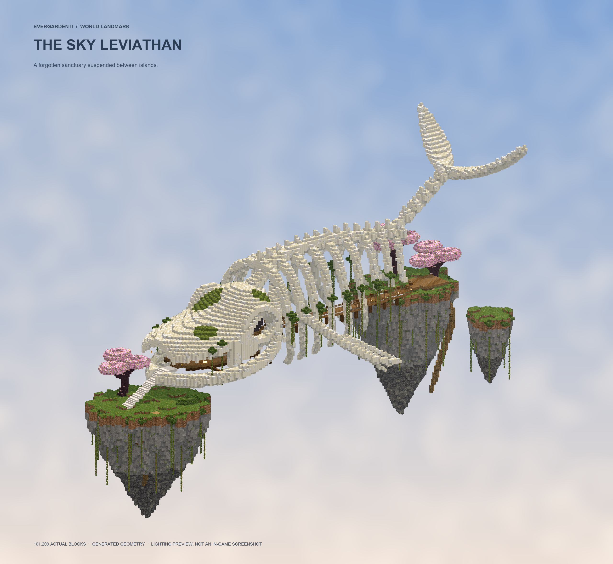

# Evergarden2 — Sky Landmarks

ซากวาฬลอยฟ้าออกแบบใหม่: กะโหลกเปิดเป็นห้องพัก กระดูกขากรรไกรโค้ง ซี่โครงที่ค่อย ๆ เรียวและมีรอยหัก กระดูกสันหลังยกไปสู่หางรูปพระจันทร์เสี้ยว ทางเดินไม้ ตะเกียง มอส และสวนเชอร์รีบนเกาะลอย

This repository is the isolated Evergarden / Advance Magic experiment. The plugin names remain compatible with the original modules. The default test world is `evergarden2`. Evergarden build `3.0.0-e2.3` places the redesigned landmark rarely across that world. Each site's main route is at Y 100–124.

## Two additional sky landmarks (3.0.0-e2.4)

The celestial observatory follows the reference's open blue/purple ribbed dome,
large oxidized-copper and gold telescope, columned terraces, cherry gardens and
waterfalls. The hanging garden has an inverted stone island, teal-roofed pavilion,
cyan crystal roots, hanging foliage and a continuous spiral staircase from its
lower arrival island to the summit. Both are ordinary vanilla blocks.

[Observatory block preview](previews/observatory-block-preview.png) ·
[Hanging garden block preview](previews/hanging-garden-block-preview.png)

These previews render the actual generated block positions with simulated lighting;
they are not Minecraft screenshots. The observatory contains 379,671 blocks and the
hanging garden 220,587. Block geometry is cached once and clipped to each chunk.

Install the updated root `dist/evergarden.jar` and restart. Existing generated
chunks are preserved; the new landmarks appear in **fresh chunks**. Admin commands:

```text
/evergarden tp observatory
/evergarden tp garden
```

`structures.observatory.enabled` and `structures.hanging-garden.enabled` toggle
the two types separately. They share the world's saved whale spacing/chance and
accepted grid cells. Each eligible cell searches for a non-overlapping pair around
the unchanged whale position. Crowded cells that cannot fit both skip the pair.
In three 289-cell tests, counts were exactly equal across all three types:
89/89/89 for seed 72819345, 68/68/68 for 12345, and 89/89/89 for -817342.
The new geometry also avoids the existing sanctums and spawn area.

All three landmarks use **`structures.treasure`**: one chest, a 30% chance of a
second, two crop stacks, and the original bonus weights by default. Every chest
always contains one randomly chosen repair/damage/cooldown core. Changing the
shared settings affects newly generated chests, never refills previously claimed
chests. The one-time marker survives chest removal and server restarts.

The disposable Paper test checks the generated blocks, clear route headroom,
stair directions, persistent leaves, shared loot settings, and chest removal plus
player edits across a real server restart:

```text
python tests/sky-landmarks/run.py --paper-template /path/to/paper-template --paper-jar paper.jar --java-home /path/to/jdk25
```

`evergarden/tests/SkyLandmarkChecks.java` checks reachable treasure, bounds,
determinism, placement rates and exclusions without a server; supplying an output
directory exports the exact blueprints as CSV. Render them with
`tools/preview_landmarks.py <exports> --minecraft-jar <client.jar>` (NumPy/Pillow).

## Actual block previews



[Skull sanctuary close-up](previews/sky-whale-sanctuary-detail.png) · [Complete side view](previews/sky-whale-side-preview.png)

These are renders of the **101,209 block positions** in `SkyWhale.blocks()`, including the floating islands. Vanilla textures are read from a locally installed Minecraft client; lighting and sky are simulated. These images are not Minecraft client screenshots. The renderer adds no foreground structures. The shape is also verified against chunks generated by Paper.

## Build and try

Requires Java 25+ and Maven. Run `./build.sh` or `mvn -pl afterdeath,advance-magic,evergarden -am package -DskipTests`. This produces `afterdeath/target/afterdeath.jar`, `advance-magic/target/advance-magic.jar`, and `evergarden/target/evergarden.jar`. `./build.sh` also copies them to `dist/`, without copying files to a server.

## AfterDeath

`dist/afterdeath.jar` adds the AfterDeath plugin from the Afterdeath repository. A death clock is awarded only for a death that drops items and was not caused by another player; this avoids awarding one for PvP deaths and keep-inventory deaths. The clock goes into an available inventory slot, and a full inventory is left unchanged. The clock lasts 120 seconds; select it and right-click to return to the death location. Operators can test with `/deathclock`. `/platform` identifies Java or Bedrock players; Bedrock detection requires Floodgate, which remains optional.

Install on a separate test server. These JARs use the existing plugin names, so use one version of each plugin per server. An administrator can jump to the approach island of the nearest whale site with:

```text
/evergarden tp whale
```

**Already generated chunks keep the old design.** To view the redesign, use a fresh isolated test server/world. `plugins/Evergarden/world-layout.yml` stores the locked world name: editing only `dimension.world-name` does not switch an existing installation to a new world. Preserve existing worlds and player data.

`structures.sky-whale.enabled` controls generation in fresh chunks. Each 32×32 chunk grid cell has a 12% placement attempt; spawn protection and temple clearance can reject it. In a sample of 289 cells with the default seed, 89 sites survived, giving roughly one site per 900×900 blocks. This is a sparse, village-like target, not an exact village generation rule or fixed distance. The site in each cell is deterministic from the world seed. `structures.sky-whale.spacing-chunks` (32–64) and `chance` (0–1) are saved to `plugins/Evergarden/world-layout.yml` when first installed; changing the config afterward does not move sites in an existing world. The landmark uses ordinary blocks, persistent leaves, mature cave vines and no display entities, mobs, or scheduled animation. Its geometry is cached once and indexed by chunk. This does not constitute a many-player performance benchmark.

## Verification

`python3 tests/sky-whale/run.py --paper-template /path/to/disposable-paper-template --java-home /path/to/jdk`

The probe creates its own temporary server, checks seed-stable sparse placement and a second distant site, every structure block and the surrounding reserved air, positive and negative chunk boundaries, 153 walkable route points, generation in reversed chunk order, default-seed temple separation, disabling the landmark, and saved-world reload behavior. It never regenerates an existing user world.

## Reproduce previews

After building, export with Java 25+ and the Paper dependency classpath:

```sh
java --class-path "evergarden/target/classes:<Paper dependencies>" tools/ExportSkyWhale.java > /tmp/sky-whale.csv
uv run --with pillow --with numpy tools/preview_sky_whale.py /tmp/sky-whale.csv
```

The renderer discovers local Minecraft textures or accepts `--minecraft-jar PATH`. Textures themselves are not copied into this repository.

## Whale treasure

The skull library gains one chest (70%) or two (30%), beside the bookshelves.
Each chest contains one random wand-upgrade core (repair, damage, or cooldown) and two crop stacks: each independently selects Tier 3 (75%) or
Tier 4 (25%), then one seed (35%) or 1–2 produce (65%). Crops within a tier are equally likely.
One optional bonus is rolled per chest: one key shard (30%), one Astral Dust (15%),
one Nether Star (3%), one random Limit Break scroll (1.5%), or one random Unique
Enchant skill scroll (0.5%); the remaining 50% gives no bonus. No Advance Magic cores
or Eternity scrolls are included. This averages 0.39 key shards and 0.039 stars per whale.

Rewards are shared, one-time exploration loot. A persistent chunk marker prevents
refills after looting, chest removal, chunk reloads and normal server restarts.
Existing whales are eligible when their library chunk loads (including at startup).
Previously generated whale chests receive one random wand upgrade when their library chunk next loads.
Occupied positions or missing library blocks are skipped permanently to preserve builds.
Install the updated `dist/evergarden.jar` and restart the server.

## Resource packs

The Advance Magic Java pack with the new flying staff is served from its bundled host on TCP 8187 by default. Its SHA-1 is calculated from the ZIP embedded in `dist/advance-magic.jar`; see `/magic pack` for the public URL and status. Bedrock packs and Geyser mappings are embedded in the JARs and installed locally when Geyser-Spigot is present. See [the flying staff setup and checks](docs/flying-staff-implementation.md) for controls, `allow-flight=false`, and anti-cheat permissions. Wand upgrade cores work only by dropping a core onto a wand in the player inventory; anvils cannot upgrade or repair wands.
