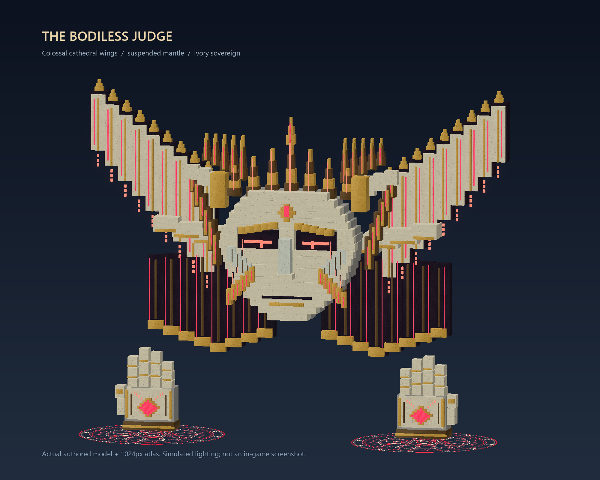

# ผู้พิพากษาไร้ร่าง / The Bodiless Judge

The ancient 241 × 241 temple hosts a multipart world boss: a sculpted ivory mask,
seven bronze/gold crown spires, a layered cathedral crown, recessed crimson eyes,
carved cheek plates, luminous fractures, two plated hands and a gemstone heart.
The enlarged mask now sits between colossal ivory/gold cathedral wings and a
suspended dark mantle with gilded tails and red gems. The 692-cuboid sculpture
uses a shared 1024px atlas and tapered crown tips, with 25 sculpture components, spell planes while attacking
and 52 emerald markers only during judgment. There are no permanent spell planes
on or behind the head, keeping the face clear from every viewing direction.
Java players without the addon see solid block displays using the same dimensions.
Display bounds are computed from every mesh's actual dimensions. This includes
the outward wing vanes and mantle tips, which exceeded the old 36-block box.
Bedrock geometry bounds are centered on each authored mesh, including the head offset.



This preview renders the actual authored meshes and atlas with simulated lighting.
It is not an in-game screenshot. The new crimson circles use the same full-bright
textured-plane technique as Advance Magic's Solar and Chronos. Five original
1024px transparent textures contain nested rings, angular runes, interlocking
stars, attack lanes and rays. Their editable SVG sources are in `evergarden/art/judge`.
Java uses double-sided item displays; Geyser receives the same artwork on stable
world-space particle planes. Dust warnings are shown only to viewers without
usable circle textures. Layered red seals charge above the crown before judgment;
smaller seals summon hand strikes, crossing lanes and annular waves.

Enter the arena in Survival or Adventure and **right-click the existing amethyst
floor at its center with an empty main hand**. This also works in temples generated
by the previous release; installing this build does not regenerate the structure.
The boss stays absent until deliberately summoned. Boss bars, named attackable
parts, floor warnings, sounds and Thai instructions explain the encounter.

## Combat

* Phases 1–2: destroy either hand to open the core for 12 seconds. The gemstone descends
  and its core hitbox shrinks into melee reach, while the mask stays overhead. Breaking the other hand extends
  the opportunity; after a missed window a broken hand returns with 45% health.
  Hitboxes move into position immediately in the damage callback. An opening
  cancels the current ordinary attack and gives three seconds to approach;
  ordinary attacks then resume while the heart remains damageable. This replaces
  the previous full 12-second attack pause.
* Core phase boundaries are 70% and 35%. A large combo reaches the boundary and
  starts the next sealed phase instead of skipping every phase with one cast.
  The phase-two title explicitly says that both hands have regenerated and
  either hand must be destroyed again.
* Phase 3: the face remains recognizable with fragments slowly orbiting behind
  it. The heart and its small hitbox remain visible at floor level, even while
  sealed. A red floor seal and countdown say to dodge and wait; a green seal,
  glowing heart and title say to attack. The heart opens automatically
  after eight seconds, then alternates 12-second openings with ten-second seals.
  All mechanics can be completed by one player.
* Phase 1 opens with **Sky Beams**: 5–10 separate red magic circles at the same
  height, 60 blocks above the floor and clear of the entire crown. Centers stay at least 20 blocks apart, so
  their 18-block casting circles do not overlap. Each has a radius-seven floor
  warning and a thin aim ray, then fires a strong downward beam after 2.2 seconds.
  The overhead casting circle remains visible during the beam impact.
* Ordinary attacks also include targeted hand slams, rotated crossing lanes,
  annular waves and **Lances**, three parallel lanes separated by 22 blocks.
  The dispatcher excludes the previous pattern from its next selection.
  Slam radii are 11/12 blocks in phases 1/2, with 2.4/2.6-second warnings so their
  wider area still leaves sprint escape time. Crossing lanes are 10/11/12 blocks
  wide across phases 1/2/3. Wave bands are 14/16/16 blocks wide and center their
  radius near a participant instead of choosing an unrelated random distance.
  Phases 2 and 3 use two- and three-pulse combos. Each new pulse gives a complete
  new warning; cross pulses turn by 30 degrees. A pulse locks its area at charge
  start, so warnings never chase a player. Spell damage uses sonic-boom damage
  to pierce vanilla armor and enchantments. Resistance, absorption and plugin
  defensive effects remain active. Raw difficulty scaling is compensated on
  Easy/Hard; ordinary hits are capped at 70% of Max HP before defenses, with
  sky beams adding 15% up to an 80% ceiling. This prevents full-health ordinary
  hits from accidentally becoming the forced-death mechanic.

| Phase | Pulses per combo | Cross warning | Wave warning | Recovery after combo |
| --- | --- | --- | --- | --- |
| 1 | 1 | 2.0 s | 2.0 s | 2.4 s |
| 2 | 2 | 1.8 s | 1.9 s | 1.8 s |
| 3 | 3 | 1.8 s | 1.8 s | 1.4 s |

* **Final Judgment is exclusive to phase 2**: first available twelve seconds
  after the phase transition, then 130–150 seconds
  after its previous charge. An eight-second warning pauses normal attacks.
  Four green sanctuaries, each radius 16 at distance 48 from the center, are
  shown using green resource-backed seals and vanilla emerald markers. Reach any of them before
  the countdown ends. Even the arena edge is within about 41 blocks of safety.
  Judgment kills participants outside the circles, including flying players,
  despite vanilla armor, Protection, Resistance, absorption, Totems, Phoenix
  Rebirth and the Soul Ward vegetable. It sets HP directly to zero, using the
  same final bypass technique found in True Death. No curse levels, hit stacks,
  True Death configuration or dungeon encounter are reused. Leaving the arena avoids death but does not remove
  the participant's scaling contribution.
* **Phase 3 summons temple bosses**: Shadow Overlord, Astral Archon and Chronos
  Vanguard cycle across one summon per retained participant. Their species,
  crowns, armor, scale and solo boss stats follow the existing temples. They
  target participating Survival/Adventure players and are recalled inside
  the arena. Late participants add one summon each; defeated summons stay dead.
  They drop no gear or XP and do not create independent dungeon runs or rewards.
  Surviving summons disappear on victory, abort, timeout or plugin shutdown.

Only Survival/Adventure participants are attacked. Creative spectators and
uninvolved visitors do not change the difficulty. Join by attacking a part from
inside the arena; a sealed-core hit also enrolls its attacker. The starter is
automatically enrolled. Joining during a charge means joining that live mechanic.

## Balance and configuration

Default solo health: **40,000 core HP**, **8,500 HP per hand**. Effective HP scales
by `1 + 0.65 × (participants − 1)`; four players get ×2.95 and six get ×4.25.
Health is stored in solo units and damage is divided by that factor. Existing
boss-bar progress never jumps when someone joins, dies, leaves or disconnects.
The roster remains fixed upward for that encounter, capped at 16 participants.
Damage does not secretly adjust to measured player DPS.

Final damage is capped **after weapon bonuses** at 100 melee, 80 projectile,
240 magic and 80 other damage per hit. A rolling 20-tick budget allows at most
240 damage per player across both hands, the heart and summoned bosses combined.
The Titan Hunter Max HP bonus and virtual Power are included before this cap.
Advance Magic casts are classified by their active damage context, so a staff
spell attributed directly to a player is not mistaken for a melee hit. These
caps apply only to this World Boss encounter; other weapons and fights retain
their existing rules. Tune `world-boss.damage-caps` to change them.

At 180 applied damage per second per player, deterministic combat simulations
give approximately 11.2 minutes solo, 7.1 minutes with four players and 6.6 minutes
with six. These estimates exclude movement and warning downtime, and are tuning
targets rather than measurements of live server equipment. Tune `world-boss`
values in `plugins/Evergarden/config.yml` after trying the server's actual gear.

The hitboxes carry the existing Evergarden LevelledMobs exclusions and encounter
control-resistance marker. Damage events feed shared encounter health, so Java
melee, projectiles and direct Advance Magic damage use the same phase rules.
Hitboxes must be `collidable=true`: Paper also uses this setting for client target
selection and arrow collisions. No AI, gravity or knockback is enabled. Decorative
Bedrock armor stands are unpickable and never intercept attacks; Java viewers do
not receive them. The exposed heart's visual center and real hitbox center agree.
Accepted damage also drains a replenished vanilla health shell, keeping genuine
health-loss accounting available to Advance Magic lifesteal. Shell damage stops
at one HP; excess burst still counts against encounter health, while lifesteal
uses actual shell HP loss. Vanilla damage-over-time without a player cause does
not drain the encounter health pool.

The full default config is under `world-boss`. `enabled: false` stops active fights
and disables summoning while retaining the temple. Exposure, HP, participant
scaling, attack damage, judgment timing, safe radius and rewards are configurable.
Safety clamps keep the lethal warning at least eight seconds and circles at
least radius 16. At most two bosses can be active by default; empty fights reset
after 30 seconds and encounters end after 30 minutes.

## Commands, rewards and storage

* `/evergarden tp boss-temple` — admin teleport to the existing safe entrance.
* `/evergarden boss status` — encounter state or remaining temple cooldown.
* `/evergarden boss claim` — claim queued rewards after making inventory space.
* `/evergarden boss start` — admin test summon; bypasses cooldown only. Use Survival.
* `/evergarden boss stop` — admin abort and remove all runtime entities.
* `/evergarden boss pack` — pack host URL, hash and your client status; console also works.
* `/evergarden boss pack resend` — request the Java addon again.

## Installing the graphics

Replace `plugins/evergarden.jar` and `plugins/advance-magic.jar` with both JARs
from `dist` and restart. Advance Magic 1.5.1 adds the terrain permission event
used to keep spell-created lava and Sculk out of the protected temple.
The Java addon, updated Bedrock pack and mappings are embedded in `evergarden.jar`.
The existing published relic pack and its URL/hash are preserved.

For Java, allow **TCP 8189** from players to the server. The addon host chooses
the hostname used to join Minecraft. For proxies/NAT, set
`world-boss.visuals.pack.host.public-host` to the reachable server address, or
`host.public-url` to an HTTPS reverse-proxy base. An external `pack.url` must host
the exact extracted `plugins/Evergarden/resource-packs/judge-java.zip`; the bundled
SHA-1 is computed automatically. Accept the pack prompt and check `boss pack`.
No configured public address means the addon cannot be offered from console;
player connections supply the hostname. Host failure/decline/reload failure keeps
the Java fallback and fully working hitboxes. `pack.enabled: false` disables the addon.

Local Geyser receives the updated Evergarden pack/mappings during `onLoad`.
Restart Geyser and reconnect Bedrock clients; the pack content version is 3.19.0.
External Geyser needs the extracted pack and mapping files copied to that instance.
`/evergarden boss pack` identifies `cathedral-wings-v2`, fourteen models and
twenty-five sculpture components, alongside the Java pack hash and client status.
If the installed server reports an older revision, replace its JAR and restart.
Java players can use `/evergarden boss pack resend`; an external Geyser needs
the current `evergarden-bedrock.mcpack` and `geyser-mappings.json` as well.
Colored Bedrock filaments use original glint particles via Geyser's optional bridge;
an incompatible bridge falls back to vanilla particles without stopping the fight.

Victory sets a four-hour site cooldown. Every participant credited with positive
hand/core damage receives one random Advance Magic core, two Evergarden keys and
1,500 XP by default. Each player rolls independently from all eighteen cores with
equal chances, including the four Mythics (Levitation, Solar, Chronos and Judgment).
Being nearby or damaging only summoned temple bosses does not qualify. The exact
core ID is drawn once at victory and saved; claiming cannot reroll it. Rewards
accumulate over multiple wins until there is room for the entire item bundle.
Rewards for offline/dead players or full inventories remain in `world-bosses.yml`.
They are offered on join/respawn or with `boss claim`. Atomic ledger writes prevent
repeated claims across a restart. Runtime sculptures are nonpersistent and cannot
place or drop blocks. Victory, abort, plugin shutdown and empty timeout remove
hitboxes, sculpture, boss bars, markers and owned chunk tickets. The encounter
never edits the protected arena blocks.

## Verification

`tests/ancient-judge/run.py` boots isolated Paper twice. The probe uses actual
NMS sword attacks, moving vanilla arrows, selection rays, Advance Magic calls,
pack download/acceptance/reload-failure checks, actual Titan Hunter bonuses,
melee/projectile/magic/other caps and shared rolling damage budget, aerial circle
spacing and beam damage, three horizontal lance rays, a high-HP player with
Totem/Phoenix/Soul Ward simultaneously equipped, the live
judgment countdown, spell placement above the crown, larger slam damage beyond
the old radius, rotated two-pulse combos, attacks during core openings,
resource-backed seals, green sanctuary safety, three phase
transitions, visible final heart, missed final openings and a real sword attack
after reopening, temple boss counts/species, late participant summons, no loot
or respawns for defeated summons, one core per positive contributor, queued rewards
for dead/offline players, inventory capacity, unchanged rolls after restart,
repeated-claim prevention, entity/ticket cleanup and persisted cooldowns. Pure rule
checks include sprint escape margins for each tuned area, rotated damage edges,
deterministic DPS simulations and every angle around the arena
edge for sanctuary reachability. The temple generation/protection suite remains
applicable; the structure itself has not changed.

The installed Geyser suite checks sanctuary materials and no-gravity/NO_AI
translation across five Bedrock block palettes, crimson glints, horizontal/upright
spell packets with nearby emitters and exact world centers,
and all fourteen direct custom model routes, alongside the existing Mythic spell suite.
`evergarden/tests/check_judge_assets.py` verifies Java element limits, shared atlas,
Bedrock/Java world-space geometry parity, transparent spell textures and weakpoint placement. These are real
translation checks without a client connection; visual inspection on a Bedrock
device remains manual.

```text
python tests/ancient-judge/run.py --paper-template <disposable-server> --garden-jar <evergarden.jar> --magic-jar <advance-magic.jar>
```
