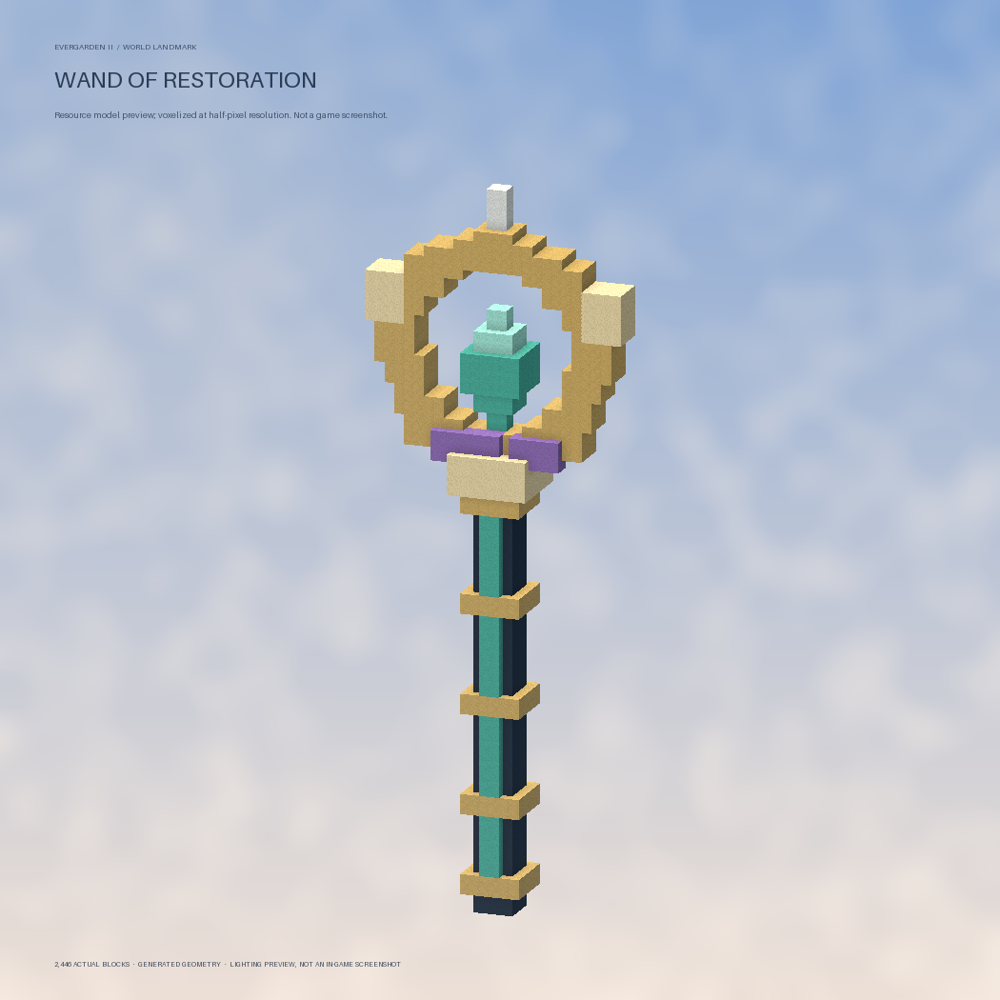
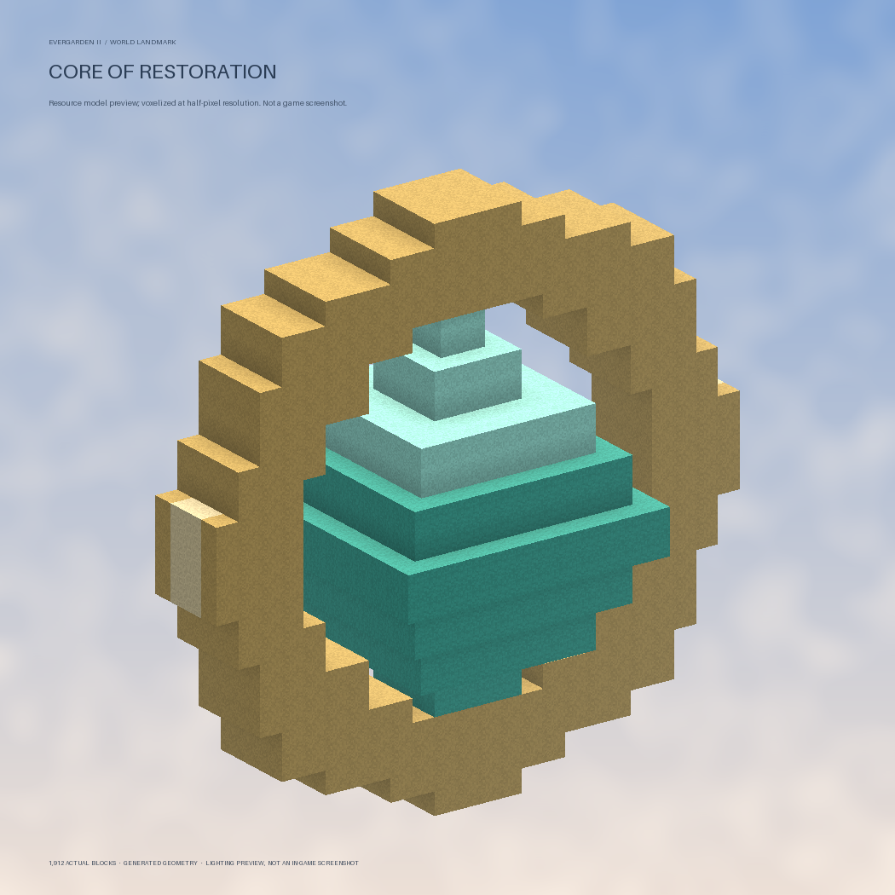
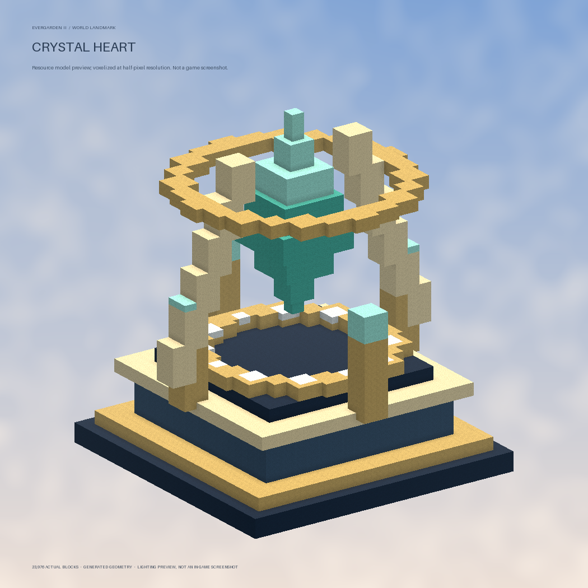
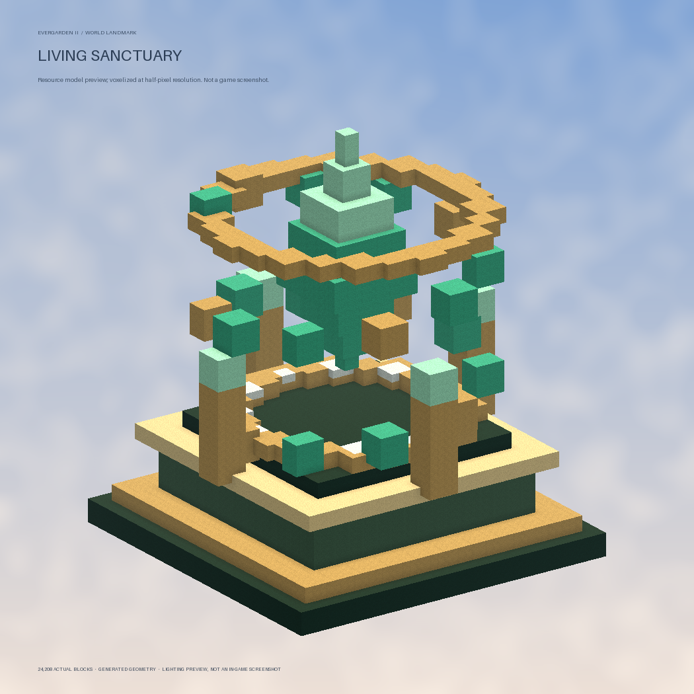
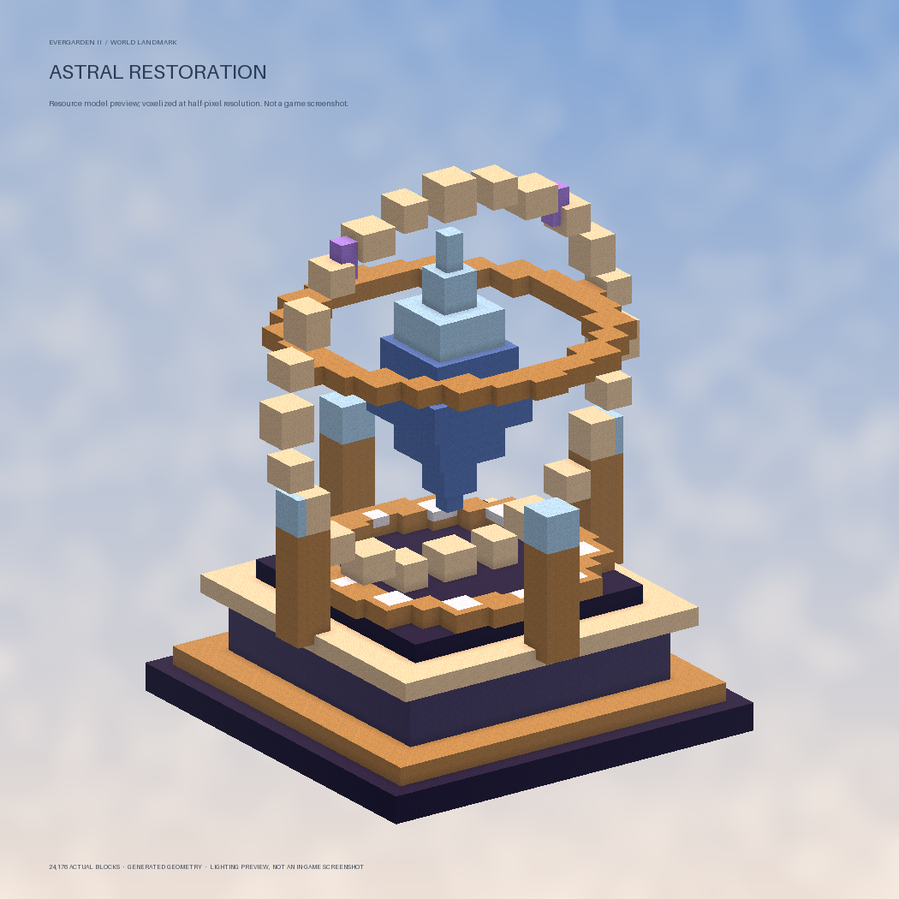

# Restoration resource update

คู่มือนี้เป็นบันทึกรุ่น Restoration เดิม แพ็กปัจจุบันคือ Advance Magic `2.1.0` / Evergarden `3.8.2` ดูการแก้ mapping และขั้นตอนติดตั้งล่าสุดใน [Bedrock item pack audit](bedrock-item-pack-audit.md)

Advance Magic `1.1.1-restoration-art` / Evergarden `3.0.0-e2.6-restoration-art`

## หน้าตาใหม่

- **Wand of Restoration:** โมเดล 3D ด้ามสีกรมท่า แถบมินต์ ปลอกทอง หัววงแหวนโอบคริสตัล และอัญมณีม่วงห้าเม็ด จำนวนครั้งยังแสดงตามจริงใน lore
- **Core of Restoration:** คริสตัลมินต์พร้อมวงแหวนทอง โมเดลและไอคอนเฉพาะ
- **Whale altar:** ฐานน้ำเงิน–ทอง คริสตัลฟ้าและซุ้มงาช้าง
- **Garden altar:** ฐานสีเขียว รากเถาวัลย์และคริสตัลมินต์
- **Observatory altar:** ฐานสีม่วง วงแหวนทองแดงล้อมคริสตัลสีฟ้า

โมเดล Java และ Bedrock สร้างจาก geometry ชุดเดียวกันใน `tools/restoration_assets.py` เป็นงานโมเดลและ texture palette ที่สร้างด้วยโค้ดตามระบบแพ็กเดิม ไม่มีการเปลี่ยน texture ของบล็อกหรือไอเท็ม vanilla ทั่วไป

รูปตัวอย่างเป็นภาพเรนเดอร์จาก geometry ของ resource pack ไม่ใช่ภาพหน้าจอในเกม:

## ของเก่า

คทาซ่อมและ Core ที่สร้างในรุ่นก่อนจะได้รับ item model เมื่อเข้าเกม เปลี่ยนช่องถือ เปิดกล่อง หรือเก็บของ จำนวนครั้งและข้อมูลใช้งานเดิมไม่ถูกเติมหรือรีเซ็ต

แท่นจากระบบ Restoration ที่สร้างไว้แล้วได้โมเดลหัวแท่นเมื่อผู้เล่นอยู่ใกล้ ไม่แก้บล็อกเดิม ไม่สร้าง structure ใหม่ทับ ใช้ Armor Stand ติดโมเดลบนศีรษะตามวิธีที่ระบบพอร์ทัลเดิมรองรับทั้งสอง client ตัวแสดงไม่เก็บไอเท็มผู้เล่น ไม่บันทึกลงโลก ล็อกอุปกรณ์ และถูกลบเมื่อไม่มีผู้เล่นใกล้หรือปิดปลั๊กอิน

โครงห้องและ Lodestone ยังอยู่ หากผู้เล่นไม่โหลดแพ็กก็ยังใช้แท่นผ่านบล็อกเดิมได้ รุ่นนี้ไม่เปลี่ยนระบบซ่อม จำนวนครั้ง Anvil หรือ Smithing

## ติดตั้ง

1. ปิดเซิร์ฟเวอร์ เปลี่ยน `dist/advance-magic.jar` และ `dist/evergarden.jar` คู่กัน แล้วเปิดใหม่
2. **Bedrock:** ถ้าใช้ Geyser-Spigot เครื่องเดียวกันและเปิด auto-install ตามค่าเดิม แพ็กและ mappings ใหม่จะถูกคัดลอกก่อน Geyser เริ่ม ผู้เล่นต้องออกเข้าใหม่และยอมรับแพ็ก เวอร์ชันแพ็กเป็น Advance Magic `1.3.0` / Evergarden `3.8.1`
3. **Java:** แพ็กใหม่เผยแพร่บน GitHub ใน commit `22195e2d658ffb3b79aba23c1f95bfdde8b5af7a` แล้ว รุ่น JAR นี้ใช้ลิงก์ commit นี้พร้อม SHA-1 ที่ตรงกัน เมื่อพบ URL GitHub ทางการเก่าจะย้ายเป็นลิงก์ใหม่เมื่อเปิดเซิร์ฟเวอร์หลังอัปเดต URL CDN ที่แอดมินตั้งเองจะคงเดิม
   - [Advance Magic Java ZIP](https://raw.githubusercontent.com/40000years/Evergarden2/22195e2d658ffb3b79aba23c1f95bfdde8b5af7a/advance-magic/dist/advance-magic-java.zip) — SHA-1 `23227999a6b6ae77eb9aa8b7c4fdbf49ab16ee84`
   - [Evergarden Java ZIP](https://raw.githubusercontent.com/40000years/Evergarden2/22195e2d658ffb3b79aba23c1f95bfdde8b5af7a/evergarden/dist/evergarden-java.zip) — SHA-1 `a61e5923248d962bd76181f93e576bd364366a1e`
   - ใช้ bundled host เป็นทางเลือกได้โดยตั้ง `resource-pack.url` ว่างและเปิด `resource-pack.host.enabled`; ต้องให้ผู้เล่นเข้าถึงพอร์ต 8187 / 8188
4. ดู URL และสถานะได้ที่ `/magic pack` กับ `/evergarden pack` แล้วใช้คำสั่ง `pack resend` ของปลั๊กอินนั้นเพื่อรับแพ็กใหม่

กรณี Geyser แยกเครื่อง ให้คัดลอก [Advance Magic Bedrock pack](https://raw.githubusercontent.com/40000years/Evergarden2/22195e2d658ffb3b79aba23c1f95bfdde8b5af7a/advance-magic/dist/advance-magic-bedrock.mcpack) กับ [mapping](https://raw.githubusercontent.com/40000years/Evergarden2/22195e2d658ffb3b79aba23c1f95bfdde8b5af7a/advance-magic/dist/geyser-mappings.json) และ [Evergarden Bedrock pack](https://raw.githubusercontent.com/40000years/Evergarden2/22195e2d658ffb3b79aba23c1f95bfdde8b5af7a/evergarden/dist/evergarden-bedrock.mcpack) กับ [mapping](https://raw.githubusercontent.com/40000years/Evergarden2/22195e2d658ffb3b79aba23c1f95bfdde8b5af7a/evergarden/dist/geyser-mappings.json) ไปยัง `packs` และ `custom_mappings` ของ Geyser โดยใช้ชื่อ mapping แยก `advance-magic.json` กับ `voidscape.json` แล้วรีสตาร์ต Geyser

## ผลตรวจความเข้ากันได้ของ production รุ่นก่อน

- URL Java รุ่นเดิมทั้งสองยังดาวน์โหลดได้และ SHA-1 ตรงกับค่าก่อนอัปเดต เซิร์ฟเวอร์ที่ยังไม่ได้เปลี่ยน JAR หรือ config จะยังใช้ URL/แพ็กเดิม
- เทียบ ZIP/MCpack กับ commit ก่อนหน้า: ไม่มี asset เดิมถูกลบ แพ็ก Advance Magic Java เดิมทุก entry เหมือนเดิม แพ็ก Evergarden Java เปลี่ยนเฉพาะตัวเลือก model ของ `iron_helmet` เพื่อเพิ่มแท่นใหม่; Bedrock เปลี่ยน manifest version และเพิ่มรายการใหม่ใน atlas
- Geyser mappings เก่าทุก entry ยังคงอยู่ครบ แพ็ก Bedrock รุ่นใหม่มีเลขเวอร์ชันต่างไปเพื่อให้ client โหลดใหม่เมื่ออัปเดตจริง

## สถานะ

สร้างแพ็ก Java/Bedrock และ Maven build ผ่าน ตัวตรวจ `advance-magic/tests/check_packs.py` กับ `evergarden/tests/check_packs.py` ผ่าน ตรวจลิงก์ GitHub ทั้งสี่แพ็กและสอง mapping แล้ว (mapping Evergarden ต่างเฉพาะ line ending หลัง checkout บน Windows; JSON เท่ากัน) ยังไม่ได้ดูผลจริงผ่าน Java, Bedrock PC หรือมือถือ ภาพตัวอย่างช่วยตรวจรูปทรงโมเดล แต่ไม่ยืนยันตำแหน่งการถือ/สวมบน client จริง
