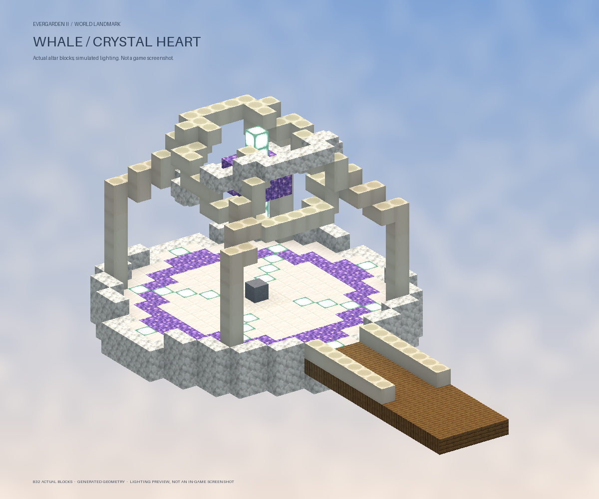
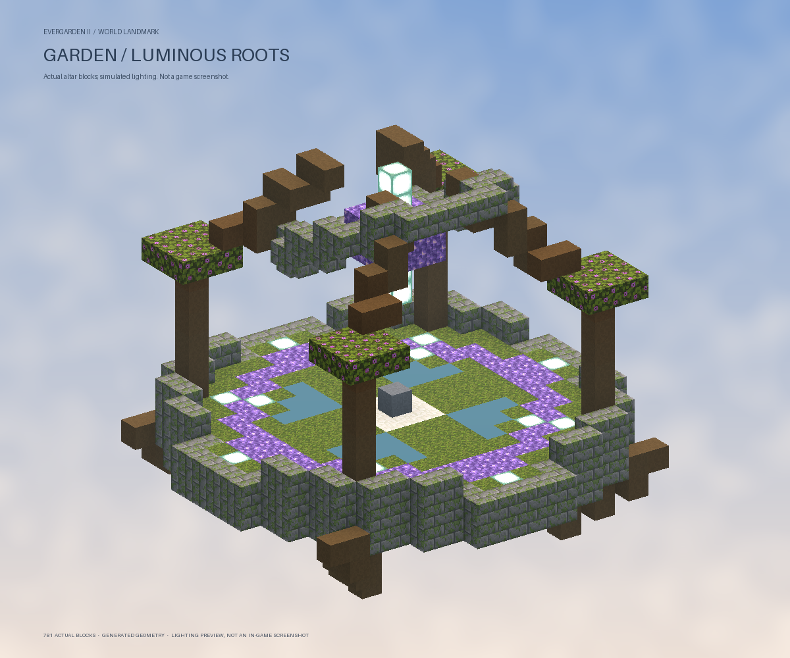
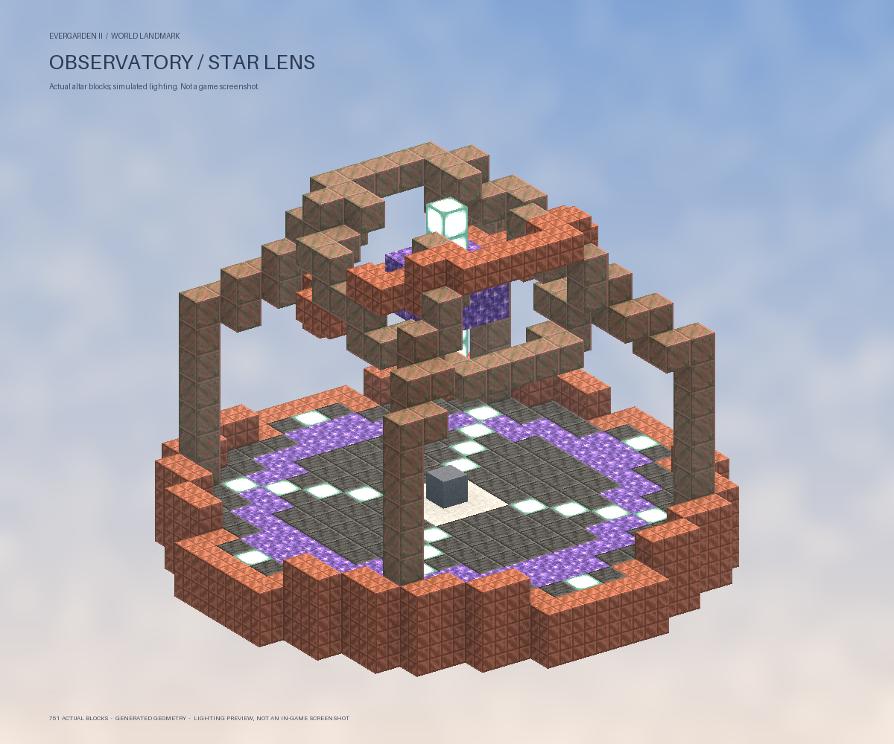

# Wand Restoration — รายละเอียดอัปเดต

> มี resource update เพิ่มโมเดล 3D ให้แท่น คทาซ่อม และ Core แล้ว ดู [รูปตัวอย่างและวิธีติดตั้งแพ็กล่าสุด](restoration-resources.md) ข้อความเรื่องรูปลักษณ์ vanilla ด้านล่างอธิบายรุ่นแรกก่อนอัปเดตนี้

ลงระบบตาม `wand-repair-plan.md` ใน Advance Magic `1.1.0-restoration` และ Evergarden `3.0.0-e2.5-restoration`

## วิธีเล่น

### ซ่อมที่แท่น

1. สำรวจ Whale, Hanging Garden หรือ Observatory ในพื้นที่ใหม่ กล่องหลักมี **Core of Restoration 1 ชิ้น** เพิ่มจากของปกติ
2. ถ้าพบแท่น Lodestone ให้ถือ Core แล้วคลิกขวา / แตะแท่น ใช้ Core เวทชนิดใดก็ได้ที่ยังไม่คราฟแทนได้
3. เปลี่ยนไปถือคทาที่ชำรุด แล้วคลิก / แตะแท่นอีกครั้ง หรือโยนคทาใกล้แท่น ภายใน 30 วินาที
4. อยู่ในระยะ 8 บล็อกระหว่างพิธี 10 วินาที เก็บ Core และคทาไว้ในช่องเดิม เมื่อจบใช้ Core 1 ชิ้นและฟื้นคทาจนเต็มเพดานของคทานั้น

Core กับคทายังอยู่ในกระเป๋าระหว่างพิธี การโยนถูกแปลงเป็นคำสั่งเริ่มพิธี ไม่มีคทาจริงลอยให้คนอื่นเก็บหรือ ClearDrops ลบ เอฟเฟกต์แสงหมุนแทนวัตถุพิธี ถ้าหลุด ตาย ย้ายโลก เดินห่าง หรือย้ายไอเท็ม พิธีหยุดโดยยังไม่ตัดของ สามารถย่อแล้วแตะแท่นด้วยมือเปล่าเพื่อยกเลิกได้

คทาเก่าที่มีข้อมูลชนิดคทาตามรูปแบบที่ Advance Magic รองรับ รวมถึงคทาเหลือ 0 ครั้ง ซ่อมได้ เก็บระดับอัปเกรด จำนวนร่ายและข้อมูลอื่นของไอเท็มไว้ ไม่เพิ่มเพดานความทนทานจากการซ่อม

**Wand Repair Core เดิม** เป็นวัตถุดิบเพิ่มเพดานความทนทาน ยังทำหน้าที่เดิม ใช้เป็นเชื้อเพลิงแท่นไม่ได้ ส่วน Core of Restoration ใหม่คราฟคทาเวทไม่ได้

### คทาซ่อมระยะไกล

- กล่องหลักมีโอกาส **10% ต่อ structure** ได้ Wand of Restoration เพิ่มอีกชิ้น
- ถือมือหลัก เล็งผู้เล่นที่ถือคทาชำรุดในมือหลัก แล้วคลิก / แตะ ระยะไม่เกิน **8 บล็อก** และต้องไม่มีสิ่งกีดขวาง
- ซ่อมสำเร็จเติมคทาเป้าหมายจนเต็มและลดพลังคทาซ่อม 1 ครั้ง ไม่ใช้ Core เพิ่ม
- มีพลังตลอดอายุ **5 ครั้ง** เมื่อหมดเก็บเป็นคทาพลังหมด ไม่มีช่องทางเติม ซ่อม หรือเพิ่มจำนวนครั้ง
- ซ่อมตัวเอง คทาซ่อมอีกอัน ไอเท็มทั่วไป และคทาที่เต็มแล้วไม่ได้ การใช้ไม่สำเร็จไม่เสียจำนวนครั้ง

## แท่นและการสำรวจ

| Structure | รูปแบบและตำแหน่ง |
| --- | --- |
| Whale | ห้องหัวใจคริสตัล ซุ้มกระดูก พื้นควอตซ์ และสะพานเชื่อมทางเดินกะโหลก |
| Hanging Garden | ลานรากไม้เรืองแสง บ่อกระจกสีและใบไม้ บนเกาะรับผู้เล่นชั้นล่าง |
| Observatory | เลนส์แสงกลางวงแหวนทองแดง บนลานใต้โดม |

แท่นกว้างประมาณ 19 บล็อก ใช้บล็อก Minecraft จริง เอฟเฟกต์ทำงานเฉพาะระหว่างพิธี ไม่ต้องใช้ resource pack ใหม่ ไม่มี interaction entity หรือ display entity ที่ต้องแปลเฉพาะ Bedrock

- **60%** ของ structure ใหม่มีแท่น ใช้ซ้ำได้ ทีละหนึ่งพิธีต่อแท่น
- แห่งที่ไม่มีแท่นมีลานซากและหินนำทาง **Chiseled Stone Bricks** ตรงกลาง แตะเพื่อดูพิกัดแท่นใกล้เคียงที่ระบบกำหนดไว้ รวมถึงพื้นที่ที่ยังไม่ได้สำรวจ
- การเกิด structure ใน cell ใหม่เริ่มที่ **3% ต่อชนิด** ก่อนเงื่อนไขระยะห่างและการหลบ structure อื่น จากเดิม 1%
- พื้นที่ที่เคยสร้างแล้วคงตำแหน่งและอัตราเดิม ไม่มีการสร้างแท่นทับของผู้เล่นหรือเติม Core ใหม่ในกล่องเก่า
- บันทึกขอบเขตพื้นที่เก่าจาก region files อย่างระมัดระวัง ดังนั้นบางพื้นที่ว่างภายใน region ที่เคยสำรวจจะยังถือว่าเป็นพื้นที่เก่า
- seed, โอกาสแท่น และประวัติอัตราเกิดบันทึกใน `world-layout.yml` การรีสตาร์ตไม่สุ่มใหม่

ภาพต่อไปนี้เรนเดอร์จาก blueprint ที่ generator ใช้ แสงและมุมกล้องเป็นภาพจำลอง ไม่ใช่ภาพหน้าจอในเกม:





## Java / Bedrock PC / Bedrock Mobile

ใช้บล็อกและไอเท็ม vanilla พร้อมชื่อ/คำอธิบายจากเซิร์ฟเวอร์ คทาซ่อมแสดงเป็น Blaze Rod เรืองแสง ส่วน Core เป็น Prismarine Crystals ไม่เพิ่ม mapping หรือ packet handler

- แท่น: Java/Bedrock PC ใช้คลิกขวา มือถือแตะบล็อก Lodestone ได้ รองรับทั้งการแตะบล็อกและการใช้ไอเท็ม ไม่ต้องกดปุ่มโยน
- คทาซ่อม: รองรับ use item, entity interaction, melee tap และ arm swing พร้อมป้องกันการนับ input ซ้ำ
- ใช้มือหลักทั้งผู้ซ่อมและผู้รับ ไม่พึ่งช่อง offhand บน Bedrock
- ไม่มีการแก้ event ของ Anvil, Smithing หรือ Smithing Template ระบบใหม่ใช้ข้อมูลจำนวนครั้งของตัวเอง

## ไฟล์และค่าตั้งต้น

ใช้ `dist/advance-magic.jar` และ `dist/evergarden.jar` **คู่กัน** เปลี่ยนไฟล์ขณะปิดเซิร์ฟเวอร์แล้วเริ่มใหม่ เพื่อให้ลำดับโหลดและ generator ใหม่มีผล

ไอเท็มใหม่อยู่ในเมนูแอดมิน `/magic items` ช่องขวาบนสองช่อง

```yaml
structures:
  restoration:
    unexplored-chance: 0.03
    altar-chance: 0.60
    repair-wand-chance: 0.10
```

สองค่าแรกเป็นค่าเริ่มต้นของการย้ายข้อมูลรอบนี้ เมื่อบันทึกใน `world-layout.yml` แล้วจะอ่านค่าที่บันทึกเพื่อรักษาตำแหน่งโลก ส่วน `repair-wand-chance` ใช้กับการเติมกล่องใหม่ ไม่มีผลย้อนหลังต่อกล่องเดิม

## สถานะการตรวจ

- Maven build ผ่านทั้งสองโมดูล โดยข้าม tests
- ตรวจ source ว่างานรอบนี้ไม่ได้แก้ handler ของ Anvil / Smithing เดิม
- สร้างภาพตัวอย่างจาก geometry จริงของแท่นและปรับทางเดินเชื่อม
- ยังไม่ได้ทดสอบเข้าเกมด้วย Java, Bedrock PC หรือมือถือจริง และยังไม่ได้ทดสอบร่วมกับชุดปลั๊กอิน production
- การซ่อมที่แท่นบันทึก Core และคทาใน inventory ผู้เล่นคนเดียวพร้อมกัน ส่วนการซ่อมระยะไกลบันทึกผู้จ่ายก่อนผู้รับ; หากระบบล่มตรงช่วงบันทึกระหว่างผู้เล่นสองคนอาจเสียหนึ่งครั้งโดยเป้าหมายยังไม่ถูกบันทึก ระบบนี้ไม่ได้ใช้ฐานข้อมูลธุรกรรมข้ามผู้เล่น
