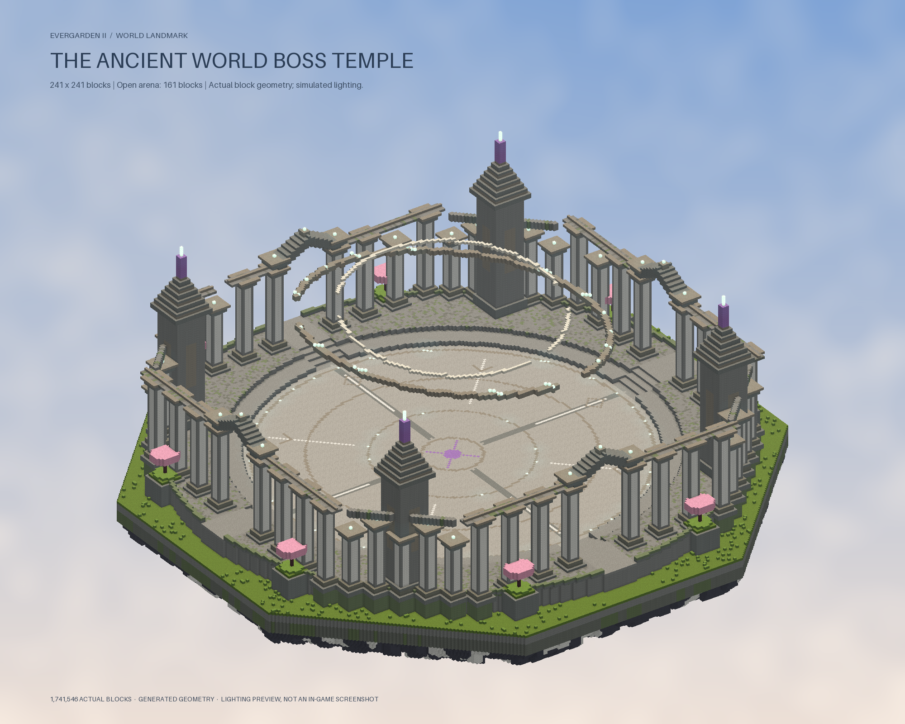

# Ancient World Boss Temple

A world boss arena in the Evergarden dimension. Its octagonal floating
foundation spans **241 × 241 blocks**, over four times the existing sanctuary's
57-block protected width. The circular combat floor is **161 blocks across** at
Y=100, with 49 blocks of uninterrupted overhead clearance. The blueprint has no
spawner or vault. The [Bodiless Judge](ancient-judge.md) encounter is summoned by
interacting with the existing central amethyst floor; it also works in temples
generated before the boss release.

Four broad entrances descend into an inlaid stone arena. Weathered colonnades,
pointed gateways, four stepped watchtowers, copper trim, amethyst crowns, cherry
urn gardens and two broken celestial rings frame the open courtyard. All artwork
uses vanilla blocks and appears on both Java and Bedrock without a special pack.



The preview is a rendering of exported block geometry with simulated lighting,
not an in-game screenshot. The complete structure contains 1,741,546 solid blocks.
Ordered boxes are indexed by chunk, and generation writes only to the current
chunk. No placement tasks or display entities are used.

## Placement and configuration

```yaml
structures:
  world-boss-temple:
    enabled: true
    spacing-chunks: null
    chance: null
```

At initial setup, null values inherit the Hanging Garden's sky spacing and current
unexplored-cell chance: normally 32 chunks and 0.03. A distinct seed salt rolls
one independent candidate per cell. Collision checks can reject candidates near
regular sanctuaries, whales and other landmarks, so the final frequency is lower
than the raw chance. Each footprint fits inside its grid cell.

The plugin persists spacing, chance and cells explored before this feature in
`plugins/Evergarden/world-layout.yml` under `world-boss-temple-*`. Existing cells
are excluded to prevent cut-off temples. Later config rate/spacing edits do not
move existing candidates. Existing Garden, Observatory and Whale layouts remain
unchanged. Temples appear in fresh cells; existing chunks are not rebuilt.

Admins can visit the closest temple using `/evergarden tp boss-temple` (also
`world-boss-temple`). It validates the entrance floor and two-block headroom before
teleporting. The command searches up to 64 placement cells in each direction.

## Protection

The footprint is protected from Y=40 through Y=205, including the foundation,
architecture and air above the combat floor. Survival players cannot mine,
build, use buckets, move blocks with pistons, burn the structure, flood it or
destroy it with explosions. Growth, decay, entity block changes, dispensers and
portal creation also respect the region. Creative admins retain the established
Evergarden maintenance bypass; Survival operators are still protected.

The matching Advance Magic build adds cancellable `MagicTerrainEvent` checks
before reserving or painting spell terrain. Evergarden cancels these checks in
the arena, preserving its floor while spell damage and visuals remain available.
Install both matching JARs for that protection. Older Advance Magic builds still
boot and produce an update warning. Disabling this structure disables generation
and its region protection; it does not remove existing blocks.

## Verification

`tests/world-boss-temple/run.py` creates an isolated Paper server and checks two
boots. It compares 1,741,546 solid blocks and 6,249,860 reserved air positions
against the blueprint, generates chunks in reverse order, checks all combat
headroom and cardinal approaches, dispatches protection events, checks spell
terrain cancellation, verifies the safe teleport, and confirms stable placement
after restart/config edits. No live world is copied or modified.

```text
python tests/world-boss-temple/run.py --paper-template <disposable-paper-template> --garden-jar <evergarden.jar> --magic-jar <advance-magic.jar>
```

To recreate the preview, export `tools/ExportWorldBossTemple.java` using the built
Evergarden classpath, then run `tools/preview_world_boss_temple.py` with its CSV.
